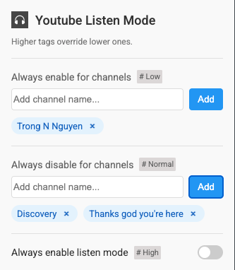
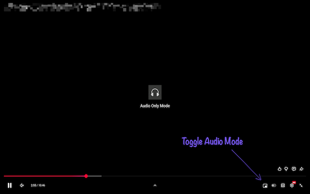

# 🎧 YouTube Listen Mode Chrome Extension

A lightweight Chrome extension that turns watching Youtube video into **audio‑only mode**.

It should also be easy to install by cloning this repo and load it into Chrome as an unpacked package.

---

## ✨ Features

| Feature | Description |
|---------|-------------|
| **One‑click toggle** | A headphones / video icon appears in the player bar to switch between normal video and audio‑only mode. |
| **Overlay when audio‑only** | A dark overlay with the extension icon and the text “Audio Only Mode” appears over the video area. |
| **Auto‑enable/disable options** |Automatically start (or stop) audio‑only mode by channels. |

## Screenshots

Extension settings:

Audio Mode:

## 📜 License

This project is open source and available under the **MIT License**.

---

*Built with ❤️ and 🤖.*
