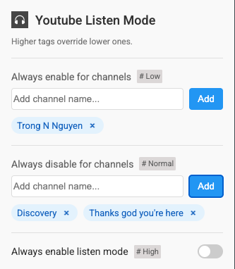
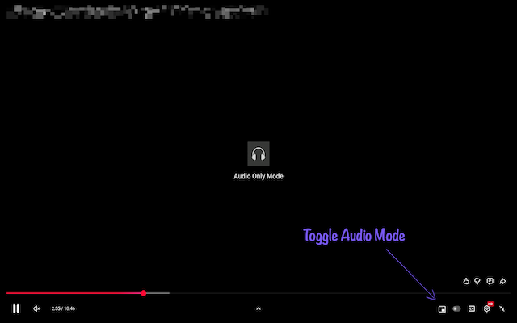

# 🎧 YouTube Listen Mode Chrome Extension

A lightweight Chrome extension that turns watching Youtube video into **audio‑only mode**.

It should also be easy to install by cloning this repo and load it into Chrome as an unpacked package.

---

## ✨ Features

| Feature | Description |
|---------|-------------|
| **One‑click toggle** | A headphones / video icon appears in the player bar to switch between normal video and audio‑only mode. |
| **Overlay when audio‑only** | A dark overlay with the extension icon and the text “Audio Only Mode” appears over the video area. |
| **Bandwidth Saver** | **[NEW]** Automatically switches video quality to the lowest setting (144p/tiny) when enabled, and restores your previous quality when disabled. |
| **Auto-enable logic** | Configure how the extension activates automatically: • **Global auto-enable**: Starts audio-only mode on every YouTube page. • **Channel whitelists**: Specify channel names to automatically enable the mode. • **Priority-based logic**: Handles conflicts between global and channel-specific settings. |

## Screenshots

Extension settings:

Audio Mode:

## 📜 License

This project is open source and available under the **MIT License**.

---

*Built with ❤️ and 🤖.*
